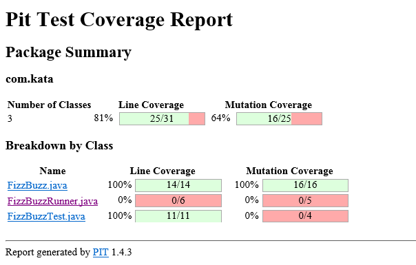

# FizzBuzz
Code to print numbers 1 to 100 while multiple of 3 are printed Fizz, multiple of 5 are printed Buzz and multiple of both 3 and 5 are printed FizzBuzz


# Purpose
This is an Practice program to showcase Test Driven Development


# Prerequisite:

````
Jdk 1.8 and Ide (Eclipse or Intellij)
Junit and hamcrest jar
````

# How to run this App

Follow below instructions to run this app
````
-git clone https://github.com/dishantj4/FizzBuzz.git
-Go to src/main/java/com/kata/FizzBuzzRunner.java and run with java application to get following output
1
2
Fizz
4
Buzz
.
.
94
Buzz
Fizz
97
98
Fizz
Buzz

-Go to src/test/java/com/kata/FizzBuzzTest.java and run the Junit Test case.
````

# Code Coverage




